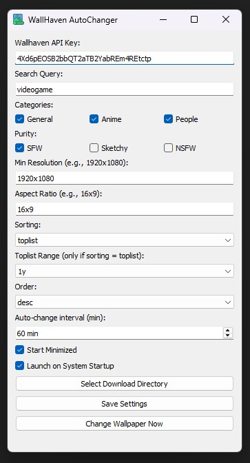

# 🖼️ WallHaven AutoChanger

WallHaven AutoChanger is a lightweight Windows app that automatically fetches and applies wallpapers from [Wallhaven.cc](https://wallhaven.cc), based on filters you define.

---

## 🌟 Features

- ✅ Use your own WallHaven API key
- ✅ Filter by category, purity, resolution, tags
- ✅ Auto-change wallpapers on a schedule
- ✅ "Change Now" button for instant swap
- ✅ Tray minimization and background support
- ✅ Saves all preferences in a config file

---

## 🖥️ Screenshots

> 📸 Below are a few screenshots from the app interface:

---

## 📦 How to Use

1. Download the latest release `.exe` from the [Releases](https://github.com/sahil40/wallhaven-autochanger/releases) section
2. Run `WallHaven AutoChanger.exe`
3. Paste your [WallHaven API key](https://wallhaven.cc/settings/account)
4. Set your filters and timing preferences and select "Download Directory"
5. Click **Save Settings**
6. Enjoy dynamic wallpapers from your favorite categories!

---

## 💬 Support

Found a bug or want a new feature? Open an issue or reach out!

---

## 👨‍💻 Author

Made with ❤️ by Sahil
[GitHub Profile](https://github.com/sahil40)
